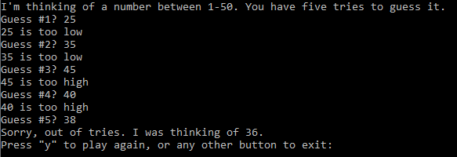
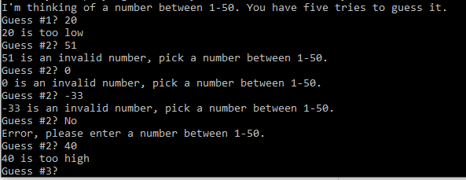

# Guess the Number.py
You have 5 tries to guess the correct number that can be between 1-50. The game gives you feedback after every guess attempt to tell you if your guess is higher or lower than the random number. The game contains exception handling and refunds your guess attempt if an invalid number is entered. After the number is guessed or you run out of tries, the game will ask if you would like to play again.

Screenshots of the game below

Guessing the correct number:

Running out of tries:

Handles exceptions that occur when user enters numbers that are out of range or contain the wrong type. Additionally, refunds the guess attempt: 

