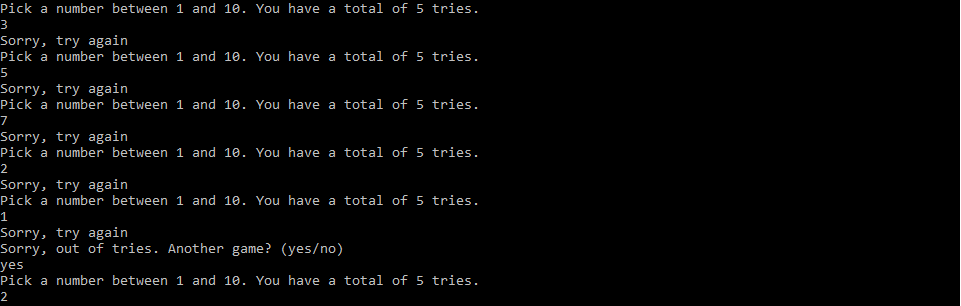

# Guess the Number.py
You have 5 tries to guess the correct number that can be between 1-10. The number is randomized every game.

Screenshots of the game below

Guessing the correct number:

Running out of tries:

Replay game feature:

Handles exceptions that occur when non-numbers are entered:

